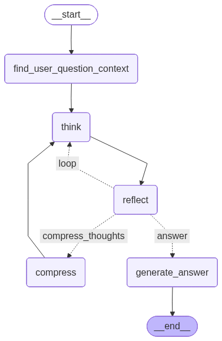
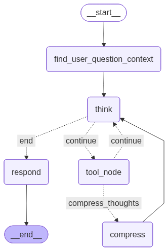

# Agent-Orchestrated-Hybrid-RAG

### Project Goal

The business goal of this project is to create a Polish medical chatbot, commissioned as a group project at the Gdańsk University of Technology.

### What I Learned

During the first semester, I experimented with various RAG architectures and read scientific papers on state-of-the-art techniques.
Throughout this entire project, I learned about architectures such as Graph RAG, bi-encoder-based RAG, standard RAG, Agentic RAG, and Hybrid RAG.
Additionally, I actively searched for solutions that would contribute to improving retrieval quality. Solutions such as rerankers, and various chunking strategies like doc2query, semantic chunking, fixed chunks, agentic chunking, sentence-based chunking, overlap chunking, and context-enriched chunking are no longer foreign to me. I also tested breaking down input questions into smaller ones and generating hypothetical documents.
Depending on the problem, each approach has its pros and cons, and no solution is perfect.

### Problems

The most important problems that need to be addressed are the explainability of answers, hallucinations, the cost of the solution, and the ease of providing new knowledge. Furthermore, the language model used, Bielik (11B parameters), is not adapted for tool use and does not support structured outputs (e.g., based on BaseModel). In addition, this model has a limited context window, which is a significant problem, and it does not follow instructions well (e.g., it often adds unnecessary text, even when asked not to!).
Keeping these limitations in mind, I decided to create the architecture below.

### Solution

Despite Bielik's limitations, I decided that explainability is the most important aspect of this project, so I opted for Agentic RAG. The agent was implemented using the LangGraph framework, where workflows are created very intuitively in the form of a graph. Underneath, Hybrid RAG acts as the retrieval mechanism (a combination of BM25 + embeddings), accompanied by an RRF Reranker (keyword search allows us to find exactly what we are looking for directly, while embeddings find the same thing written in a different way, which is crucial in medicine).
Due to a limited budget [$0 =)], chunking is performed as follows:

1. Split the document into sentences using regex.
2. Collect sentences into a `<current_chunk></current_chunk>` bin until the total character count exceeds 600.
3. If there is any text before the chunk: Add the last 3 sentences from the previous chunk to `<previous_chunk></previous_chunk>`.
4. If there is any sentence after the chunk: Add the first 3 sentences from the next chunk to `<next_chunk></next_chunk>`.

The intuition behind this chunking is that we have a black box that points with some approximation to where in the book something similar to what we are looking for is located.
By navigating to this fragment, we increase the chances that the answer is somewhere close to it, so we allow the agent to navigate through adjacent chunks.

Communication with Bielik can be clunky, and prompt engineering did not help much. Therefore, in some places in the code, a few possible options (mistakes) that the LLM might make are handled.

**WARNING! The project is not ready for production deployment, although it is planned!**

---

## Installation

To install and test this project, ensure that you only have Docker installed and have access to the Bielik API.
If we want to change the model to another one, we can do it in `src/agent/main.py` (you need to add the LLM API to `.env`). The following dependencies are required to make changes to the project:

* docker
* python 3.11
* uv

### .env Example

```bash
LLM_USERNAME=""
LLM_PASSWORD=""

# Optional, if you don't have access to Bielik. You need to adjust the code in src/agent/main.py
OPENAI_API_KEY=""

```

### Running

```bash
sudo systemctl start docker.service

sudo docker compose up

```

## Design

### TODO

### Agent

The initial agent architecture looked as follows (tools called in the think, reflect, and find_user_question_context nodes, but for simplicity, the nodes are hidden):



Unfortunately, Bielik is a weak model, and even though language models have a hidden representation of the world inside, they still only predict the next token and cannot think. The less we expect in a single step, the better the result will be, at the cost of expanding the workflow with additional steps and prompts. Ultimately, I decided to simplify the architecture to a minimum, which can be found below (We slightly simplified the expectations from the thinking node):



* **Find user question context**:
* The user often expects the LLM to have the same context as they do, writing, for example, `Why am I sick?` (this example might not be perfect, but I hope the reader understands what I mean). The goal of this node is to try to guess what the user means and what their context is, to make sure they are both talking about the same thing. Without this, the LLM might answer correctly, but in a different context, leading the user to think it answered incorrectly.


* **Think**:
* The goal of this node is to search for answers to the asked questions in the same context as the user. It can retrieve 2 documents from the database for a given query, which return the document ID, the chunk sequence number, and a fragment containing 3 sentences from the previous chunk, the next chunk, and the current chunk which has a minimum of 600 characters (sentences are added until it exceeds this threshold). This allows the agent (if it seems the answer is a chunk lower/higher) to read the next fragment, or to move to the next fragment in another document by asking a different question.


* **Compress**:
* To allow the agent to think for a long time, a special node was added, responsible for compressing all its thoughts and documents on the principle: `If thoughts exceed X tokens -> compress thoughts using the LLM`. Ultimately, this node is also intended to filter out garbage and leave only the most important information while retaining metadata (from which fragment a given fact was extracted).


* **Respond**:
* This node generates the final answer based on thoughts (if the think node decides it has enough information to answer) in an appropriate style.